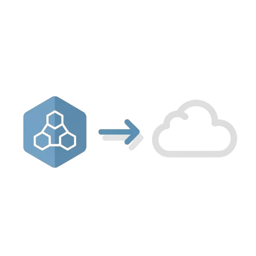
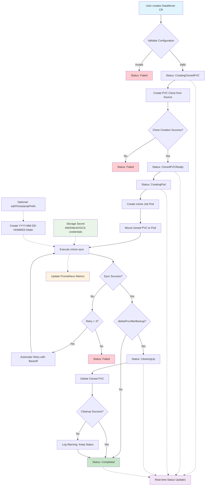

# DataMover Operator

A Kubernetes operator that automates the process of cloning PersistentVolumeClaims (PVCs) and synchronizing their data to remote storage using rclone.

## Philosophy

There are few projects that handle backups on Kubernetes (Velero, Volsync, k8up...), but none of them properly meet my needs:

- Ability to rely on VolumeSnapshot *(like Velero)*
- Does not use Kopia *(I have little confidence in it)*
- Not maintained by a **crappy** company (VMWare, I'm looking at you)

So I wanted to create my own operator that would tick all the boxes for my needs. Hello DataMover Operator!

## Description

The DataMover Operator simplifies data movement and backup workflows in Kubernetes environments. It creates clones of existing PVCs and runs data synchronization jobs to remote storage backends (S3-compatible storage, cloud providers, etc.) using rclone.

### Key Features

- 🔄 **PVC Cloning**: Automatically clones source PVCs without snapshots
- 📦 **Data Synchronization**: Uses rclone to sync data to remote storage
- 🔁 **Retry Mechanism**: Automatic retry with up to 3 attempts for failed jobs
- 🔐 **Secure Configuration**: Supports secrets for storage credentials
- 🗂️ **Timestamp Organization**: Optional timestamped folder organization (YYYY-MM-DD-HHMMSS)
- 🧹 **Automatic Cleanup**: Optional automatic PVC cleanup after successful backup
- 🌍 **Environment Variables**: Configurable environment variables for rclone operations
- 📊 **Prometheus Metrics**: Comprehensive metrics tracking for monitoring
- 📊 **Status Tracking**: Real-time status updates with phase tracking
- 🚀 **Automated Workflow**: Complete automation from cloning to data transfer

### Roadmap

- [ ] Add support for more storage backends (e.g., Azure Blob Storage, Google Cloud Storage)
- [x] Be able to set a specific image for the backup pod
- [ ] Enable Encryption at rest
- [ ] Add periodic backup scheduling
- [ ] Secrets should be optional (since customs images may require different variables)
- [ ] Support for incremental backups (?)
- [ ] Support for more advanced rclone features (e.g., filters, bandwidth limits)
- [ ] Add multiple backup software support (e.g., Restic, Borg)

### How It Works



**Process Details:**

1. **Clone Creation**: Creates a clone of the specified source PVC using CSI driver capabilities
2. **Job Deployment**: Deploys an rclone job with the cloned PVC mounted and automatic retry capability (up to 3 attempts)
3. **Data Sync**: Executes rclone synchronization to the configured remote storage with optional timestamp organization
4. **Cleanup**: Optionally cleans up the cloned PVC after successful backup
5. **Metrics**: Tracks operation metrics for monitoring and observability
6. **Status Updates**: Provides real-time status updates through custom resource status

## Getting Started

### Prerequisites

- go version v1.24.0+
- docker version 17.03+
- kubectl version v1.11.3+
- Access to a Kubernetes v1.11.3+ cluster **with CSI driver supporting volume cloning**
- Storage credentials (AWS S3, MinIO, etc.)

### Installation

#### Method 1: Quick Install

```sh
# Install CRDs and operator
cd dist/chart
helm install datamover-operator . --namespace datamover-operator-system --create-namespace
```

Or with the OCI registry:

```sh
helm install datamover-operator oci://ghcr.io/qjoly/datamover-operator-chart --version 0.0.1 -n datamover-operator-system
```

#### Method 2: Development Install

```sh
# Install CRDs
make install

# Run the operator locally (for development)
make run

# Or deploy to cluster
make deploy IMG=<your-registry>/datamover-operator:tag
```

### Configuration

#### 1. Create Storage Credentials Secret

```yaml
apiVersion: v1
kind: Secret
metadata:
  name: storage-credentials
  namespace: default
type: Opaque
data:
  AWS_ACCESS_KEY_ID: <base64-encoded-access-key>
  AWS_SECRET_ACCESS_KEY: <base64-encoded-secret-key>
  AWS_REGION: <base64-encoded-region>
  BUCKET_HOST: <base64-encoded-host>
  BUCKET_NAME: <base64-encoded-bucket>
  BUCKET_PORT: <base64-encoded-port>
  TLS_HOST: <base64-encoded-true-or-false>
```

#### 2. Create DataMover Resource

```yaml
apiVersion: datamover.a-cup-of.coffee/v1alpha1
kind: DataMover
metadata:
  name: my-datamover
  namespace: default
spec:
  sourcePvc: "source-pvc-name"
  secretName: "storage-credentials"
  addTimestampPrefix: true  # Creates timestamped folders: YYYY-MM-DD-HHMMSS/
  deletePvcAfterBackup: true  # Automatically cleanup cloned PVC after backup
  additionalEnv:
    - name: "CUSTOM_VAR"
      value: "custom-value"
    - name: "ENVIRONMENT"
      value: "production"
```

## Usage Examples

### Basic Usage

```yaml
apiVersion: datamover.a-cup-of.coffee/v1alpha1
kind: DataMover
metadata:
  name: backup-web-data
spec:
  sourcePvc: "web-app-data"
  secretName: "s3-credentials"
  addTimestampPrefix: false  # Sync to bucket root
```

### Advanced Usage with Timestamp Prefix

```yaml
apiVersion: datamover.a-cup-of.coffee/v1alpha1
kind: DataMover
metadata:
  name: backup-database
spec:
  sourcePvc: "postgres-data"
  secretName: "minio-credentials"
  addTimestampPrefix: true  # Creates timestamped backup folders
```

## Usage Examples

### Basic Usage

```yaml
apiVersion: datamover.a-cup-of.coffee/v1alpha1
kind: DataMover
metadata:
  name: backup-web-data
spec:
  sourcePvc: "web-app-data"
  secretName: "s3-credentials"
```

### Advanced Usage with Custom Environment

```yaml
apiVersion: datamover.a-cup-of.coffee/v1alpha1
kind: DataMover
metadata:
  name: backup-database
spec:
  sourcePvc: "postgres-data"
  secretName: "minio-credentials"
  additionalEnv:
    - name: "BUCKET_NAME"
      value: "my-backup-bucket"
```

### Monitoring Status

```sh
# Check DataMover status
kubectl get datamovers

# Expected output:
# NAME              PHASE       AGE
# backup-web-data   Completed   5m

# Get detailed status
kubectl describe datamover backup-web-data
```

## API Reference

### DataMoverSpec

| Field | Type | Required | Description |
|-------|------|----------|-------------|
| `sourcePvc` | string | Yes | Name of the source PVC to clone |
| `secretName` | string | Yes | Name of the secret containing storage credentials |
| `addTimestampPrefix` | bool | No | When true, creates timestamped folders (YYYY-MM-DD-HHMMSS/) for organized backups. Default: false |
| `deletePvcAfterBackup` | bool | No | When true, automatically deletes the cloned PVC after successful backup. Default: false |
| `additionalEnv` | []EnvVar | No | Additional environment variables for the rclone job |

### DataMoverStatus

| Field | Type | Description |
|-------|------|-------------|
| `phase` | string | Current phase of the operation |
| `restoredPvcName` | string | Name of the cloned PVC |

### Phases

- `""` (Initial): Starting state
- `CreatingClonedPVC`: Creating PVC clone
- `ClonedPVCReady`: Clone is ready
- `CreatingPod`: Creating rclone job (with automatic retry up to 3 attempts)
- `CleaningUp`: Cleaning up cloned PVC (if deletePvcAfterBackup is true)
- `Completed`: Data sync completed successfully
- `Failed`: Operation failed

## Storage Backend Configuration

### AWS S3

```yaml
AWS_ACCESS_KEY_ID: your-access-key
AWS_SECRET_ACCESS_KEY: your-secret-key
AWS_REGION: us-west-2
BUCKET_HOST: s3.amazonaws.com
BUCKET_NAME: my-backup-bucket
BUCKET_PORT: "443"
TLS_HOST: "true"
```

### MinIO

```yaml
AWS_ACCESS_KEY_ID: minio-access-key
AWS_SECRET_ACCESS_KEY: minio-secret-key
AWS_REGION: us-east-1
BUCKET_HOST: minio.example.com
BUCKET_NAME: backups
BUCKET_PORT: "9000"
TLS_HOST: "false"
```

### Google Cloud Storage

```yaml
AWS_ACCESS_KEY_ID: your-access-key
AWS_SECRET_ACCESS_KEY: your-secret-key
AWS_REGION: auto
BUCKET_HOST: storage.googleapis.com
BUCKET_NAME: my-gcs-bucket
BUCKET_PORT: "443"
TLS_HOST: "true"
```

## Monitoring and Metrics

The DataMover Operator provides comprehensive Prometheus metrics for monitoring:

### Available Metrics

- `datamover_operations_total`: Counter of total operations by phase and status
- `datamover_phase_duration_seconds`: Histogram of phase durations
- `datamover_cleanup_operations_total`: Counter of PVC cleanup operations

### Reliability Features

- **Automatic Retry**: Jobs automatically retry up to 3 times on failure
- **Backoff Strategy**: Kubernetes handles exponential backoff between retries
- **Failure Tracking**: Detailed metrics track retry attempts and final outcomes

## Troubleshooting

### Common Issues

#### 1. PVC Clone Fails
```sh
# Check if your CSI driver supports volume cloning
kubectl get storageclass -o yaml

# Ensure the source PVC exists and is bound
kubectl get pvc source-pvc-name
```

#### 2. Rclone Job Fails

```sh
# Check job status and retry attempts
kubectl get jobs -l app=datamover-rclone

# Check job logs (latest pod)
kubectl logs job/verify-<pvc-name>

# Check secret configuration
kubectl get secret storage-credentials -o yaml
```

#### 3. Permission Issues

```sh
# Check RBAC permissions
kubectl auth can-i create persistentvolumeclaims
kubectl auth can-i create jobs
kubectl auth can-i create pods
```

### Debug Commands

```sh
# Get all DataMover resources
kubectl get datamovers -A

# Check operator logs
kubectl logs -n datamover-operator-system deployment/datamover-operator-controller-manager

# Check created resources
kubectl get pvc,jobs,pods -l app.kubernetes.io/created-by=datamover-operator

# Check job status and retry attempts
kubectl get jobs -A

# View job details and retry information
kubectl describe job verify-<pvc-name>
```

## Development

### Building from Source

```sh
# Clone the repository
git clone https://github.com/qjoly/datamover-operator.git
cd datamover-operator

# Build and test
make test
make build

# Build container image
make docker-build IMG=your-registry/datamover-operator:tag
make docker-push IMG=your-registry/datamover-operator:tag
```

### Running Tests

```sh
# Run unit tests
make test

# Run integration tests
make test-integration
```

### Contributing

1. Fork the repository
2. Create a feature branch (`git checkout -b feature/amazing-feature`)
3. Commit your changes (`git commit -m 'Add amazing feature'`)
4. Push to the branch (`git push origin feature/amazing-feature`)
5. Open a Pull Request

## Cleanup

### Uninstall

```sh
# Delete DataMover instances
kubectl delete datamovers --all

# Uninstall CRDs and operator
make uninstall
make undeploy
```

### Manual Cleanup

```sh
# Clean up remaining resources
kubectl delete pvc -l app.kubernetes.io/created-by=datamover-operator
kubectl delete jobs -l app.kubernetes.io/created-by=datamover-operator
kubectl delete pods -l app.kubernetes.io/created-by=datamover-operator
```

## License

Copyright 2025.

Licensed under the Apache License, Version 2.0 (the "License");
you may not use this file except in compliance with the License.
You may obtain a copy of the License at

    http://www.apache.org/licenses/LICENSE-2.0

Unless required by applicable law or agreed to in writing, software
distributed under the License is distributed on an "AS IS" BASIS,
WITHOUT WARRANTIES OR CONDITIONS OF ANY KIND, either express or implied.
See the License for the specific language governing permissions and
limitations under the License.

## Support

For questions, issues, or contributions, please:
- Open an issue on GitHub
- Check the [troubleshooting section](#troubleshooting)
- Review the [API reference](#api-reference)

---

**Note**: This operator requires a CSI driver that supports volume cloning. Most modern CSI drivers (AWS EBS CSI, GCE PD CSI, etc.) support this feature.
